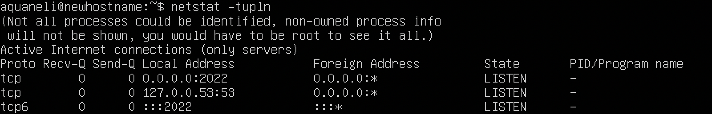
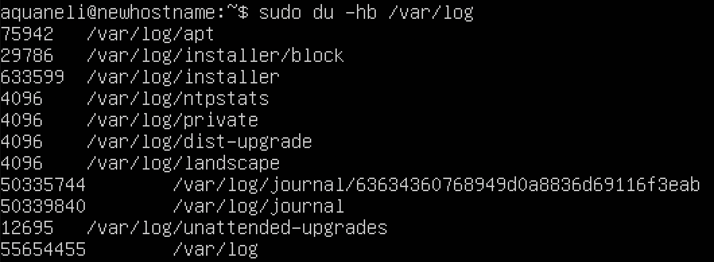

## Part 1. Установка ОС 

- Вывод команды: ```cat /etc/issue```.


## Part 2. Создание пользователя

- Cкриншот вызова команды для создания пользователя ```sudo adduser person```.

- С помощью команды ```sudo usermod -aG adm person``` мы добавили пользователя в группу adm.


---

- Cкриншот с выводом команды ```cat /etc/passwd```.


## Part 3. Настройка сети ОС

- Задал название машины user-1 с помощью команды ```sudo hostname user-1```.


---

- Так же меняем в файле ```/etc/hostname```.


---

- Вывод команды ```cat /etc/hostname```.


---

- После перезагрузки мы увидим, что hostname был изменен.


---

- Временную зону изменил с помощью команды ```sudo timedatectl set-timezone Europe/Moscow```.


---

- Названия сетевых интерфейсов с помощью консольной команды ```ifconfig -a```.

- Интерфейс lo создается автоматически при настройке сетевого подключения.
Он является виртуальным и создается программным обеспечением. Он используется для связи с компьютером через его собственный IP. Например для того чтобы протестировать какое то приложение и запустить его, необязательно загружать его в удаленный сервер, а просто запустить через свой собственный.


---

- Используя консольную команду ```sudo dhclient``` я получил ip адрес устройства от DHCP сервера.

- Используя команду ```ip addr show``` получилось вывести данные вместе с IP сетевых интерфейсов которые имеются.

- DHCP - Dynamic Host Configuration Protocol - Протокол динамической настройки узла.


---

- Чтобы определить внешний IP шлюза можно использовать команду ```curl ifconfig.me```


---

- Чтобы определить внутренний IP шлюза можно использовать команду ```ip route``` и отобразить в строке default.


---

- Чтобы задать статичные (заданные вручную, а не полученные от DHCP сервера) настройки ip, gw, dns (использовать публичный DNS серверы, например 1.1.1.1 или 8.8.8.8) можно воспользоваться командой ```sudo vim /etc/netplan/file.yaml``` и сохранить настройки ```sudo netplan apply```.


---

- Пропинговал с помощью команды ```ping -c 5 1.1.1.1``` и ```ping -c 5 ya.ru``` .


---

## Part 4. Обновление ОС

- Чтобы одновить систему нам потребуются 2 команды ```sudo apt-get update``` и ```sudo apt-get upgrade```.

- Сначала мы скачаем пакеты обновлений, а потом установим.


- После установки если мы попробуем опять установить обновления, то установки не произойдет, а выйдет сообщение.


## Part 5. Использование команды sudo

-  sudo это утилита в операционной системе, которая позволяет выполнить команды обычным пользователям от имени суперпользователя.
---

- Сначал мы дадим права суперпользователя для person


---

- Затем в учетку нашего пользователя и изменим имя hostname


---

- После перезагрузки изменилось название hostname 


## Part 6. Установка и настройка службы времени

- Снчала установим утилиту для автоматической синхронизации времени


---

- Активируем утилиту с помощью команд ```sudo systemctl start ntp``` и ```sudo systemctl enable ntp```.
Увидим что сервис активен.


---

- Укажем с каким сайтом будет происходить синхронизация.


---

- Используя команду ```timedatectl show``` увидим что NTPSynchromized=```yes```.


## Part 7. Установка и использование текстовых редакторов

- Установка VIM с помощью команды ```sudo apt-get install vim```.
- Чтобы выйти из файла с сохранением изменений нужно нажать ```esc``` и ввести ```:wq```.


---

- Установка NANO с помощью команды ```sudo apt-get install nano```.
- Чтобы сохранить изменения нужно нажать ```ctrl + O``` и чтобы выйти ```ctrl + X```.


---

- Установка JOE с помощью команды ```sudo apt-get install joe```.
- Чтобы выйти из файла с сохранением изменений нужно нажать ```ctrl + K``` чтобы открылось меню, а затем нажать
клавишу ```X```.


---

- Чтобы закрыть файл без сохранения изменений из VIM нужно нажать ```esc``` и потом ввести ```:q!```.


---

- Чтобы закрыть файл без сохранения изменений из NANO нужно нажать ```ctrl + X``` и отказаться от сохранения изменений.


---

- Чтобы закрыть файл без сохранения изменений из JOE нужно нажать ```ctrl + K``` и затем нажать ```Q```,
затем отказаться от внесения изменений в файл нажав на клавижу ```N```.


---

- Чтобы заменить слово на другое в файле через редактор VIM по нахождению я использовал ```:s/School/newtext```.


---

- Чтобы заменить слово на другое в файле через редактор NANO по нахождению я использовал комбинацию клавиш 
```ctrl + \```.


---

- Чтобы заменить слово на другое в файле через редактор JOE по нахождению я использовал комбинацию клавиш 
```ctrl + k``` , затем нажал ```f```, далее ищем слово для замены и в конце пишем слово которое хотим заменить.


---

## Part 8. Установка и базовая настройка сервиса SSHD


- Для установки сервиса я использовал команду ```sudo apt-get install ssh```.
- Затем установил ```sudo apt-get install openssh-server```.
- Далее я включил автозагрузку ```sudo systemctl enable ssh```.


---

- Переснастроил порт на 2022 в файле ```/etc/ssh/sshd_config```.


---

- Перезагрузим сервис.


- Введем команду ```netstat -tupln``` и увидим что порт 2022 используется.


---

- Используя команду ```ps -ef | grep sshd``` мы увидим наличие процесса sshd.
- Команда ```ps``` используется для того чтобы отобразить запущенные процессы.
- Ключ ```-e``` используется для того чтобы вывести процессы для всех пользователей.
- Ключ ```-f``` используется для того чтобы вывести полную информацию о процессах.
- Команда ```grep sshd``` используется чтобы вывести только те строки где содержится информация об sshd процессах. 


---

- Ключ ```-t``` отображает состояние загрузки для текущего подключения.
- Ключ ```-a``` показывает все соединения, даже те, которые находятся в режиме ожидания.
- Ключ ```-n``` выводит номера портов в числовом формате.

- Столбец ```Proto``` выводит протокол, используемый для соединения.
- Столбец ```Recv-Q``` счётчик байт не скопированных программой пользователя из этого сокета.
- Столбец ```Send-Q``` счётчик байтов, не подтверждённых удалённым узлом.
- Столбец ```Local Address``` показывает адрес и номер порта локального конца сокета.
- Столбец ```Foreign Address``` адрес и номер порта удалённого конца сокета. Аналогично "Local Address.".
- Столбец ```State``` Состояние сокета.
- Адрес ```0.0.0.0``` указывает, что клиент не подключен к сети TCP / IP.


---

## Part 9. Установка и использование утилит top, htop

- Uptime - показывает сколько времени система была включена после последнего включения или перезагрузки.
- Сейчас uptime составляет ```1:37```.
- Кол-во авторизованных пользователей ```1```
- Общая загрузка системы ```0.00 0.00 0.00```
- Общее количество процессов ```97```
- Загрузка cpu ```%Cpu(s): 0.0us, 0.0 sy, 0.0 ni, 100 id, 0.0 wa, 0.0 hi, 0.0 si, 0.0 st```.
- Загрузка памяти ```Mib Mem: 1983.4 total, 1427.1 free, 148.9 used, 407.4 buff/cache```.
- PID процесса занимающий больше всего памяти ```1```.
- PID процесса занимающего больше всего процессорного времени ```1264```.
---

- Скрины с выводом команды htop и отсортированному по PID, PERCENT_CPU, PERCENT_MEM, TIME


---

- Скрин с отфильтрованным выводом команды htop для процесса sshd.


---

- Скрин с процессом syslog, найденным, используя поиск.


---

- Скрин с добавленным выводом hostname, clock и uptime


## Part 10. Использование утилиты fdisk

- Имя диска ```Disk /dev/sda```.
- Его размер ```10 Gib```.
- Кол-во секторов ```20971520```.
- Размер swap ````1.5Gi```.


## Part 11. Использование утилиты df

- Использование df
- Размер раздела ```8408452```.
- Размер занятого пространства ```4206000```.
- Размер свободного пространства ```3753736```.
- Процент использования ```53%```.
- Измерение в мегабайтах и процентах.
---

- Использование df -Th
- Размер раздела ```8.1G```.
- Размер занятого пространства ```4.1G```.
- Размер свободного пространства ```3.6G```.
- Процент использования ```53%```.
- Тип файловой системы ```ext4```.

## Part 12. Использование утилиты du





## Part 13. Установка и использование утилиты ncdu


## Part 14. Работа с системными журналами

- Время последней успешной авторизации ```Mar 27 19:48:06```
- Имя пользователя ```aquaneli```
- Метод входа в систему ```systemd-logind```


## Part 15. Использование планировщика заданий CRON

- Используя ```sudo crontab -e``` мы открыли файл со списком задач в редакторе.
- Используя ```sudo crontab -l``` мы вывели список текущих задач.
- Для выполнения ```uptime``` каждые 2 минуты можно использовать ```*/2 * * * * uptime```.


